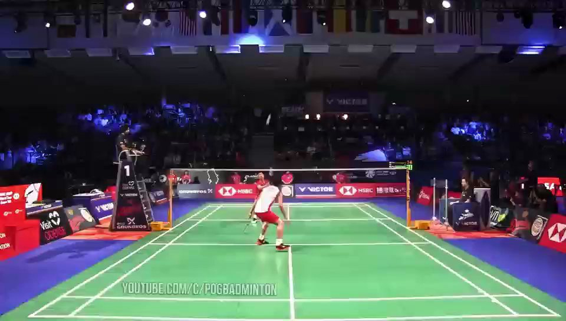
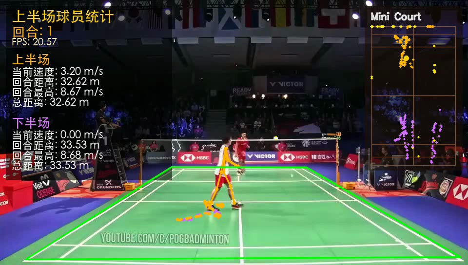
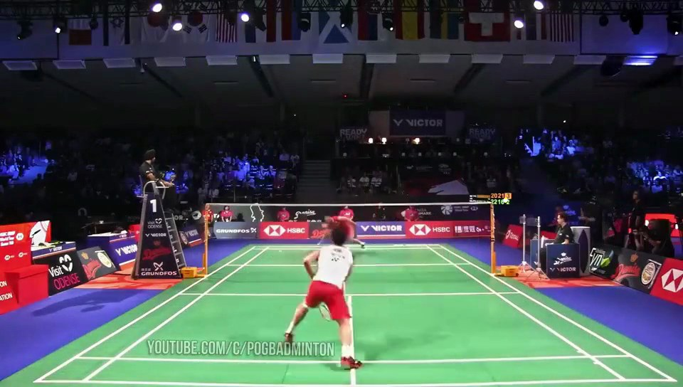

# 羽毛球比赛视频智能分析系统

**简体中文** · [English](README_EN.md)

[](https://www.python.org/)
[](https://pytorch.org/)
[](https://www.apple.com/macos/)
[](#license)
[](https://github.com/ychenfen/badminton-pipeline-repro/pulls)

把一段普通的羽毛球比赛视频，转换成带**运动员轨迹、移动速度、累计跑动距离、羽毛球飞行轨迹**的可视化分析视频，最后还能加上电影级"子弹时间"特效。

整套系统基于 **TrackNet（球检测） + YOLOv8s-pose（球员姿态） + ByteTrack（多目标跟踪） + 透视矫正**，在 Apple Silicon Mac 上跑通过完整流程。


---

## 这个项目解决了什么

市面上"开源羽毛球分析"项目通常只能做以下其中一项：
- 只检测球，没有球员分析
- 假设俯视机位（真实比赛视频几乎都是斜拍）
- 写死 Windows 路径，Mac/Linux 跑不通
- 阈值硬编码，在真实视频上静默失败（球检测率 0%）

这个仓库是**完整跑通、所有 bug 都修过、Mac 优先**的版本。每个修复都记录在 [HANDOVER.md](HANDOVER.md) 里。

---

## 效果展示

**输入**：原始比赛视频（960×544，21 fps，30 秒短样本）



**输出**：叠加分析后的视频，左侧统计面板 + 右上 Mini Court 俯视轨迹



**统计面板**（每个球员 4 项核心数据：当前速度 / 回合距离 / 回合最高 / 总距离）


**Mini Court**（俯视图轨迹：黄色 = 上半场球员，粉色 = 下半场球员，青色 = 球）


---

## 整体架构

```
原始视频.mp4
    │
    ▼  Step 1: TrackNet ─────────── 球检测（专门追小目标的连续帧热力图模型）
带球轨迹的视频 + 球坐标 CSV
    │
    ▼  Step 2: Overlay ──────────── YOLOv8s-pose + ByteTrack + Homography
叠加分析的视频
    │
    ▼  Step 3: FX ────────────────── 子弹时间冻帧 + 慢动作 + 虚拟轨道相机
最终成品视频
```

三段独立运行，每段可以单独迭代。改一次面板字号、调一次跳变阈值、加一个新特效，都不需要从头重跑。

---

## 快速开始（30 秒短视频跑通）

### 1. 克隆仓库（含 LFS 大文件）

```bash
git lfs install     # 没装的话先 brew install git-lfs
git clone https://github.com/ychenfen/badminton-pipeline-repro.git
cd badminton-pipeline-repro
```

模型权重 `weights/TrackNet_best.pt`（130 MB）和样本视频通过 Git LFS 自动下载。

### 2. 装依赖

```bash
python3 -m pip install --user --index-url https://pypi.org/simple \
    numpy opencv-python pandas Pillow torch ultralytics tqdm \
    pycocotools parse lap
```

`pycocotools`、`parse`、`lap` 是 TrackNet/ByteTrack 的隐藏依赖，原 requirements 没列全，必装。

### 3. 标球场 4 角点

整个流程**唯一需要人工**的环节。运行：

```bash
python3 scripts/tools/select_court.py short.mp4
```

弹窗里**按顺序**点 4 下：左上 → 右上 → 右下 → 左下（球场长方形 4 角，不是球网）。点完按 q，终端会输出像 `--court_points "352,342,628,343,944,527,52,532"` 这样的字符串。

样本视频 `short.mp4` 的标准答案：

```
352,342,628,343,944,527,52,532
```

效果如图（黄色四边形贴合球场边线）：


### 4. 一键跑通三段

```bash
TRACKNET_VIS_THRESH=0.15 ./run_all_mac.sh \
  --input-video short.mp4 \
  --court-points "352,342,628,343,944,527,52,532" \
  --yolo-device mps
```

参数含义：
- `TRACKNET_VIS_THRESH=0.15` — TrackNet 二值化阈值，**必须设**（默认 0.5 会让球检测率降到 0%，详见下文 §6）
- `--yolo-device mps` — YOLOv8 走 M 系列芯片 GPU 加速

跑完输出在 `~/yumaoqiu_repro/`：
- `tracknet_v3_result_regen/short_ball.csv` — 球的逐帧坐标
- `end1_fix_swap2_precision_full_regen.mp4` — 叠加分析的视频
- `end1_fix_swap2_precision_full_fx_regen.mp4` — 加了子弹时间特效的最终成品

### 5. 看 demo

仓库已附带跑好的 demo：

```bash
open demo/short_overlay_demo.mp4
```

---

## 三段详解

### Step 1 — TrackNet（球检测）

**它解决的问题**：羽毛球只有几个像素、飞得快、容易模糊，单帧 YOLO 之类的检测器经常漏。

**它的思路**：一次吃 4 帧连拍，输出 4 张概率热力图（每个像素值 = 这里是球的概率）。利用连续帧的运动信息识别出模糊的球。类比：你看一张静态照片可能看不出蚊子在哪，但 4 张连拍就能看出"有什么东西在那一带飞过"。

**输出**：



视频上小圆圈是模型识别出的球轨迹。同时生成 CSV：

```csv
Frame,Visibility,X,Y
0,1,455,202
1,1,455,202
4,1,481,122
...
```

`Visibility=1` 表示这一帧检测到球，X/Y 是球在画面里的像素坐标。

**关键参数**：

| 参数 | 含义 | 推荐 |
|---|---|---|
| `--tracknet_file` | 模型权重 | `weights/TrackNet_best.pt` |
| `--device` | 推理设备 | `auto`（Mac CPU；NVIDIA cuda） |
| `--large_video` | 流式 dataloader | 长视频必须加 |
| `--eval_mode` | `nonoverlap` / `weight` | `nonoverlap` 快 8 倍 |
| `TRACKNET_VIS_THRESH`（环境变量） | 二值化阈值 | **0.15-0.20** |

### Step 2 — Overlay（球员检测 + 数据叠加）

整个项目 90% 的工程量在这一段，干 5 件事：

1. **YOLOv8s-pose** 检测每帧球员 + 17 个人体关键点（脚踝精确定位"足点"）
2. **ByteTrack** 维持球员 ID 跨帧不串
3. **Homography** 透视矫正：把斜拍画面里的梯形球场拉成俯视长方形
4. **MotionStats** 算每个球员的瞬时速度 / 累计距离 / 最高速度
5. **绘制叠加层**：左侧面板 + 右上 Mini Court + 球员骨架 + 轨迹线

**透视矫正示意**：

```
画面里的梯形                标准球场坐标系（俯视）
                              (0, 0) ─────── (6.1, 0)
   TL ──── TR                    │              │
    \      /                     │              │
     \    /     ──→ Homography ─→│              │
      \  /                       │              │
   BL ──── BR                    │              │
                              (0, 13.4)─── (6.1, 13.4)
```

OpenCV 一行调用：

```python
H, _ = cv2.findHomography(court_quad, dst_rectangle)
```

之后任何脚点像素坐标都能投影到球场米制坐标，距离/速度计算跟机位无关。

**为什么要球员脚踝不用 bbox 中心**：bbox 中心是身体中心，离地有 1 米多高；脚踝在地面上，投影更准。`estimate_foot_point()` 优先取左右脚踝平均，置信度低时退到 bbox 底中点。

### Step 3 — FX（子弹时间特效）

电影《黑客帝国》Neo 躲子弹那个慢镜头围绕镜头转的镜头。这里是单机位轻量版：

- 选定一些时间点（"子弹时刻"，可手动 / 均匀分布 / 自动峰值检测）
- 在该时刻**冻帧** 28 帧，期间用虚拟相机做小幅度旋转 + 缩放
- 冻帧后接 **40 帧慢动作**（每帧重复 6 次，可选插值）
- 然后回到正常播放

完全不依赖检测结果，纯粹是对 Step 2 的输出做后期。

---

## 参数速查表

### 跑别的视频要改什么

1. `--input-video` 路径
2. 重新跑 `select_court.py` 标 `--court-points`
3. 如果机位完全不同（前场低位 / 侧场），可能要调 `--court_length_m`（全场 13.4，半场 6.7）

### 全长视频时间预估（M4 Pro）

| 阶段 | CPU | MPS（GPU） |
|---|---|---|
| TrackNet（13344 帧） | ~3 小时 | 暂不支持，需改代码 |
| Overlay | ~30 分钟 | ~10 分钟 |
| FX | ~5 分钟 | 同上 |

**最大瓶颈是 TrackNet**，用 PyTorch MPS 后端能压到 30 分钟。改造方案见 [HANDOVER.md](HANDOVER.md) §10 Task P1.1。

---

## 常见问题

**Q：球完全检测不到（Visibility 全 0）**
A：检查 `TRACKNET_VIS_THRESH` 环境变量是否设了 0.15。原代码硬编码 0.5 在大多数视频上不工作。详见 [HANDOVER.md](HANDOVER.md) §6.1.4。

**Q：球员速度显示 24 m/s（比博尔特还快）**
A：跳变阈值过松导致 ID 串变被记进 max_speed。已修复为 `8.0 × dt + 0.05` 自适应阈值。详见 [HANDOVER.md](HANDOVER.md) §6.2.7。

**Q：中文显示成方块**
A：字体回退已加了 macOS PingFang.ttc。如果还报错，确认 `/System/Library/Fonts/PingFang.ttc` 存在。

**Q：球场轮廓画歪了**
A：`select_court.py` 点的顺序错了，必须 TL → TR → BR → BL。可加 `--draw_court_polygon` 让 overlay 视频里画出绿色四边形检查。

**Q：`ModuleNotFoundError: pycocotools / parse / lap`**
A：原 requirements.txt 没列全，按本文档"装依赖"那条命令补上。

更多问题排查：[HANDOVER.md](HANDOVER.md) §8。

---

## 项目结构

```
badminton-pipeline-repro/
├── README.md                       # 本文件（中文快速上手）
├── HANDOVER.md                     # 1500+ 行详细交接文档（含 AI agent 任务包）
├── README_MAC.md                   # macOS 启动笔记（原作者）
├── CHAIN_EVIDENCE.md               # 原作者解释为什么这条 pipeline 是"最可信"链
├── run_all_mac.sh                  # macOS 一键脚本
├── run_all.ps1                     # Windows PowerShell 一键脚本
├── requirements_repro.txt          # Python 依赖
├── short.mp4                       # 30 秒样本视频（LFS）
├── b13b2c0b...mp4                  # 全长 10 分 35 秒比赛视频（LFS）
│
├── weights/                        # 模型权重（LFS）
│   ├── TrackNet_best.pt            # 球检测（130 MB）
│   └── yolov8s-pose.pt             # 球员姿态（23 MB）
│
├── demo/
│   └── short_overlay_demo.mp4      # 跑好的成品 demo（LFS）
│
├── docs/images/                    # README 配图
│
└── scripts/
    ├── tracknet_runtime/           # Step 1: TrackNet
    │   ├── predict.py              # 入口
    │   ├── model.py                # 网络结构
    │   ├── dataset.py              # 数据加载
    │   ├── test.py                 # 工具函数
    │   └── utils/general.py        # HEIGHT=288, WIDTH=512 等常量
    │
    ├── overlay/
    │   └── overlay_player_analytics.py   # Step 2: 1340+ 行核心
    │
    ├── fx/
    │   └── video_fx_bullet_time.py       # Step 3: 特效
    │
    └── tools/                      # 调试工具
        ├── select_court.py         # 交互式标球场角点
        ├── diag_tracknet.py        # 诊断 TrackNet heatmap 强度
        └── render_panel_preview.py # 单独渲染面板预览
```

---

## 这个项目踩过的坑（精简版）

| 问题 | 现象 | 修复位置 |
|---|---|---|
| TrackNet 球检测 0% | csv 全 0 | `predict.py:35` 阈值 0.5 → 环境变量 |
| 球员速度 24 m/s | 面板数字离谱 | `overlay_player_analytics.py:602` 阈值 1.2m → `8×dt+0.05` |
| 中文方块 | macOS 字体路径 | `overlay_player_analytics.py:18-27` 字体回退表 |
| 面板信息冗余 | 每球员 7 个数字 | 砍到 4 个核心 |
| 球场 quad 错位 | 距离速度全错 | `select_court.py` 重新人工标 |

完整变更清单：[HANDOVER.md](HANDOVER.md) §9。

---

## 后续工作

[HANDOVER.md](HANDOVER.md) §10 列了 12 个详细任务（P0-P3），每个都按"背景 / 目标 / 步骤 / 涉及文件 / 验证 / 已知陷阱"格式写好，AI agent（Codex / Cursor / Claude）可以直接挑一个任务从那里起步。

最优执行顺序：

```
P0.1 写默认值进 sh        → 15 min
P0.2 清理临时文件          → 已完成
P0.3 全长视频跑 baseline   → 3-4 小时
P1.1 TrackNet MPS 加速     → 2-4 小时
P1.2 缓存 detections.json  → 3-5 小时
P1.3 YOLO 跳帧检测         → 1-2 小时
P2.1 球轨迹补漏（卡尔曼）  → 3-4 小时
P2.2 击球点 + 自动回合分割 → 4-6 小时
P2.3 Mini Court 视觉增强   → 1-2 小时
P3.1 Gradio Web UI         → 1-2 天
P3.2 多机位适配            → 1-2 天
P3.3 数据导出 + 热力图     → 4-6 小时
```

---

## 致谢

- TrackNet 模型来自 [TrackNetV3](https://github.com/qaz812345/TrackNetV3)
- YOLOv8 来自 [Ultralytics](https://github.com/ultralytics/ultralytics)
- ByteTrack 跟踪算法 [ByteTrack](https://github.com/ifzhang/ByteTrack)
- 样本视频出自 YouTube 频道 POGBADMINTON

---

## License

代码部分 MIT。模型权重和样本视频按各自原始来源的 license 使用，仅供学习研究。

---

## 引用

如果这个项目帮到了你的研究、论文、或产品，star 是最简单的支持方式。论文引用：

```bibtex
@misc{badminton_pipeline_repro,
  author       = {ychenfen},
  title        = {Badminton Match Video Analytics Pipeline},
  year         = {2026},
  howpublished = {\url{https://github.com/ychenfen/badminton-pipeline-repro}}
}
```

如果你做了改进或衍生项目，欢迎提 PR / Issue / Discussion。

---

## 关键词

羽毛球, 视频分析, 图像识别, 运动分析, 计算机视觉, 目标检测, 多目标跟踪, 球员追踪, 球轨迹, 透视变换, 单应性矩阵, 子弹时间, 慢动作, 体育数据分析, AI 教练, 羽毛球训练, 比赛复盘, 战术分析, OpenCV, PyTorch, YOLOv8, TrackNet, ByteTrack, Apple Silicon, M4 Pro, MPS, macOS, badminton, sports analytics, video analytics, computer vision, object tracking, shuttle detection, player tracking, court homography, bullet time, TrackNet, YOLOv8, ByteTrack, OpenCV, PyTorch, Apple Silicon, macOS.
